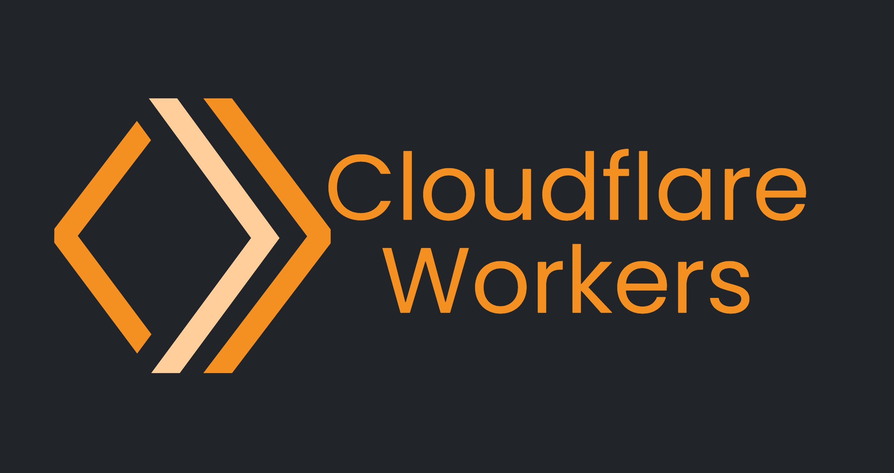

## The Serverless Promise

Workers allow you to deploy Javascript code to Cloudflare's 200+ datacenters all around the world. Then whenever someone makes an HTTP request to your assigned `*.workers.dev` or your custom domain, your code will be executed in a V8 instance. (Chrome's JS engine) This happens so fast, it's as if your code was already running in every datacenter around the world. But that's the point, it's only running when needed. You are billed per code invokation and per GBs (Gigabyte second) of compute time with a generous free tier. See their  [billing page](https://developers.cloudflare.com/workers/platform/pricing).

For further configuration of the Worker runtime, we can specify environment variables, KV bindings, Durable Object bindings, build commands, etc. in the [wrangler.toml](https://developers.cloudflare.com/workers/wrangler/configuration/)

## Storage

Workers has three native storage options, and can of course also be used with other hosted services like Redis or MongoDB.

### KV: Redis for Workers

See the [KV documentation](https://developers.cloudflare.com/workers/runtime-apis/kv/) for full details

KV allows read write operations to a globally distributed document* database. (All values must be strings) This allows for extremely high read and write volumes but lacks transactability (such as keeping a global counter) or instant read reflection, ususally taking 10-60 seconds to see the results of writes reflected. KV is useful for low write, high read volumes or data which doesn't require instant propogation.

With KV you can also attach any arbitrary metadata to key-value pairs including expiration dates which will be enforced by the system. Finally, we can list keys optionally given some search prefix.

Pioche allows you to store any type, list all key-value pairs with an optional key prefix, and access documents at depth using Javascripts native chaining syntax.

### Durable Objects: In Memory KV + Compute

See the [Durable Objects documentation](https://developers.cloudflare.com/workers/runtime-apis/durable-objects/) for full details

So now it gets weird: Durable Objects are a short lived execution environment defined by a single Javascript class as well as an ID. This means that we can execute code on the Durable Object itself. Invokations and GBs are charged at the same rate as workers so if we intend to use Durable Object storage it is both faster and cheaper to run the logic there too.
* There is only one Durable Object per class-id pair running at any given time worldwide
* Durable Objects can only receive requests from Workers
* If there is not yet a Durable Object running for the class-id pair, it will be started in the same datacenter as the Worker that requested it
* Durable Objects have an in memory transactional key-value store that is written to disk and globally distributed upon shutdown
* Durable Objects will only stay running for as long as they are processing requests
* Durable Objects allow for websockets and will stay alive as long as there is one connected

The in memory storage has a simple `.get()` `.put()` interface as well as the option to get all items by key prefix and the ability to delete items. Strangely expiring keys and listing keys are not natively supported as they are in KV.

To send a request to the Durable Object, you access the `env.<DurableObjectBinding>` (the binding is set in the wrangler.toml) then call one of the `.newUniqueId()`, `.idFromName(name: string)`, or `.idFromString(hexID: string)`. With this ID we can then generate a stub using the `.get(ID)` and finally on that stub we can call `.fetch()` using the standard fetch API, except the URL does not define the destination anymore.

Finally, storage must be allocated for Durable Objects so you need to run "migrations" i.e. you keep a list of migrations in the wrangler.toml each specifying new_classes, deleted_classes, and renamed_classes then wrangler will perform the migrations as needed.

Pioche handles bindings, Worker to Durable Object handoffs, migrations, id generation, and routing for you without loss of functionality and further allows you to list keys with expiring keys planned for a future version.

### D1: In Memory SQLite + Compute

D1 is nearly identical to Durable Objects in how the execution environment functions: separate and only callable from Workers, single instance globally, and short lived. D1 rather than a key-value in memory database instead allows the use of SQLite which is replicated globally upon shutdown. D1 is still in closed beta, this portion will be completed when it becomes open.

Pioche does not have any special features for D1 yet, but all native API's are still usable from within a Pioche app.

### R2: S3 for Workers

See the [R2 documentation](https://developers.cloudflare.com/workers/runtime-apis/r2/) for full details

R2 is a Cloudflare hosted alternative to AWS S3 with a native API to interact with buckets. R2 buckets must be bound in the wrangler.toml

Pioche does not have any special features for R2, but all native API's are still usable from within a Pioche app.